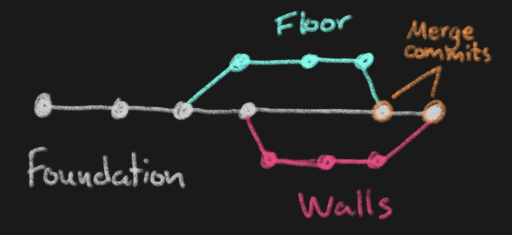
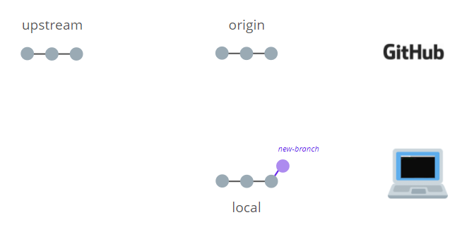
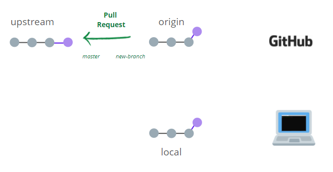

```{r setup, include=FALSE}
options(htmltools.dir.version = FALSE)
```

```{r xaringan-themer, include=FALSE, warning=FALSE}
library(xaringanthemer)
library(xaringanExtra)
library(tidyverse)
library(knitr)
library(nomnoml)
library(countdown)
xaringanExtra::use_logo(
  image_url = "https://raw.githubusercontent.com/rstudio/hex-stickers/master/PNG/xaringan.png"
)
xaringanExtra::use_panelset()
xaringanExtra::use_broadcast()
xaringanExtra::use_share_again()
xaringanExtra::style_share_again(share_buttons = c("twitter", "linkedin"))
xaringanExtra::use_tachyons()
xaringanExtra::use_fit_screen()
xaringanExtra::use_tile_view() # O
style_mono_accent(
  base_color = "#0dc96f",
  background_color = "#ffffff",
  inverse_background_color = "#3298cb",
  header_color = "#022044",
  inverse_header_color = "#ffffff", 
  inverse_text_color = "#ffffff",
  code_inline_color = "#179c55",
  link_color= "#0000FF",
  text_font_size = "25px",
  header_font_google = google_font("Poppins", "Regular", "400"),
  text_font_google   = google_font("Darker Grotesque", "500"),
  code_font_google   = google_font("Fira Mono"),
  )

```

```{r metathis, warning=FALSE, echo=FALSE}
# library(metathis)
# meta() %>%
#   meta_name("github-repo" = "flor14/rladies-jujuy") %>% 
#   meta_social(
#     title = "Meetup R-Ladies Jujuy",
#     description = paste(
#       "Mi próximo artículo científico con R:", 
#       "Compendios de Investigación, Reproducibilidad e",
#       "Interactividad en las publicaciones académicas"
#     ),
#     url = "https://flor14.github.io/rladies-jujuy/presentacion.html?panelset=licencia#1",
#     image = "https://res.cloudinary.com/flor/image/upload/v1608248822/jujuy-colores_frmvax.jpg",
#     image_alt = paste(
#       "Charla para el capítulo de R-Ladies de Jujuy, Argentina.",
#       "Diciembre de 2020"
#       ),
#     og_type = "website",
#     og_author = "Florencia D'Andrea",
#     twitter_card_type = "summary_large_image",
#     twitter_creator = "@cantoflor_87",
#     twitter_site = "@cantoflor_87"
#   )
```


class: middle, center

```{r hex, fig.align='center', echo = FALSE, out.width=150} 
    knitr::include_graphics("img/hex.png")
```


---


class: bottom

.bg-washed-blue.b--dark-blue.ba.bw2.br3.shadow-5.ph4.mt5[
### DSCI 521 - Lecture 3
### **Branches, forks, and streams... Welcome to the Git nature walk!**

 .large[#### Computing Platforms for Data Science - UBC MDS 2021/22
]]


---

## Lecture 3

1. **Develop a feature on a branch** in a Git repo.

--

2. **Merge** the feature branch with the master branch.

--

3. Create a **fork** of an existing GitHub repo.

--

4. Open a **pull request** from your forked repo to the upstream repo


---

class: center, middle, inverse

# BRANCHES
separate work that is happening on the main/master branch of the repo 

---

## Why to use them?

* You don't want the repository's default branch to be updated with every commit of a half-finished feature.

--

* When features are completed, their branches will be merged into the main branch, often through a "pull request" where code is reviewed before it is merged. 

--


```{r commits, fig.align='center', echo = FALSE,out.width=200} 
knitr::include_graphics("img/represent.png")
```


---

## Feature-based development

```{r obj4, fig.align='center', echo = FALSE,out.width=400} 

```


```{r house2, fig.align='center', echo = FALSE,out.width=400} 
knitr::include_graphics("img/house.jfif")
```

.footnote[[Unsplash](https://unsplash.com)]

---

class: middle, center, inverse

# How branches show up in the log output

---

class: center, middle


## `main` is the default branch


.footnote[_Note: [`master` branch is now called `main` branch](https://github.com/github/renaming)_]

---

### How branches show up in the log output

```bash
HEAD -> main
```

--

**main** is your default local branch
(or **master**) 

--

**HEAD** is where you currently are   

--

#### _You are on the main branch_

.footnote[_Note: [`master` branch is now called `main` branch](https://github.com/github/renaming)_]

---

### How branches show up in the log output

```bash
origin/main
```

--

**origin** is a nickname for your remote repo on GitHub

--

**origin/main** is the main branch on your GitHub repo

--

#### _You Github repo is on the main branch_

.footnote[_Note: [`master` branch is now called `main` branch](https://github.com/github/renaming)_]

---

### How branches show up in the log output

```bash
origin/HEAD
```
--

You don't need to be concern about origin/HEAD, it just point to the default remote branch, 
which will always be main unless you mess around with the settings on the GitHub webpage.

.footnote[_Note: [`master` branch is now called `main` branch](https://github.com/github/renaming)_]


---

class: center, inverse, middle

# How do we create a branch?


---


## Switch to a branch
#### `git switch`


## Switch to a new branch
#### `git switch -c <name new branch>`
#### `git switch -c lecture-todo`


.footnote["It is good practice to give branches a name that succinctly describes the feature that you want to develop."]


---

class: middle, center

```{r lecturetodo, fig.align='center', echo = FALSE,out.width=900} 

```


---


class: inverse, center, middle

# SEEING HOW BRANCHES ARE RELATED


---

## In the shell


* `git log --oneline --all --graph`


```{r log, fig.align='center', echo = FALSE,out.width=700} 
 
```


---

## In VS Code

* `code .`

```{r vs, fig.align='center', echo = FALSE,out.width=700} 
 
```


To merge the branches run `git merge lecture-todo`

---

class: inverse, center, middle
# FORKS

---
class: middle, center

#### If you want the code from someone else's repository, where you are not a member or official collaborator, **then you can clone it and use it on computer.** 

--

.bg-washed-blue.b--dark-blue.ba.bw2.br3.shadow-5.ph4.mt5[

#### However, **you cannot push your changes back to the GitHub repository** because you don't have the write permissions to that repository.

]


---

### How can I fork a repository?

Forks are copies of others repositories on GitHub that you own.

**"upstream" repository** the one you forked from

 **origin** your repository

```{r 2, fig.align='center', echo = FALSE,out.width=800} 
knitr::include_graphics("img/2.png")
```


---

class: center, middle

```{r f, fig.align='center', echo = FALSE,out.width=900} 

```


---

### How can I start developing in a forked repo

You clone the fork of YOUR repo, not the original repo


```{r 3, fig.align='center', echo = FALSE,out.width=800} 
knitr::include_graphics("img/3.png")
```


---
class: center, middle
```{r 5, fig.align='center', echo = FALSE,out.width=700} 

```


---
class: center, middle
```{r 6, fig.align='center', echo = FALSE,out.width=700} 

```


---

class: middle, inverse, center

# DEVELOPING IN A FORKED REPO

---

### Work in a new local branch

It is good practice to always create a branch when you are about to add changes to a fork

```bash
git switch -c new-branch
```

```{r 7, fig.align='center', echo = FALSE,out.width=700} 

```


---


### When to merge?
When you are working on a branch you have to push your branch to GitHub and ask for it to be merged via a pull request. 

```{r 8, fig.align='center', echo = FALSE,out.width=600} 
knitr::include_graphics("img/8.png")
```


---

## Pushing to a new branch

```{r branch, fig.align='center', echo = FALSE,out.width=900} 

```

.footnote[the word "upstream" is not referring to the GitHub branch you forked from. Instead, it is referring to a branch that will be created on your repo (origin).]


---

## Pushing to a new branch

```bash
git push --set-upstream origin new-branch
```
```{r 81, fig.align='center', echo = FALSE,out.width=600} 
knitr::include_graphics("img/8.png")
```


---

class: middle, center
```{r PR, fig.align='center', echo = FALSE,out.width=600} 

```


.footnote[The Turing Way and Scriberia (2020)]

---


class: inverse, center, middle

# CREATING A PULL REQUEST

---

## Pull request

To create PR, you click the green bottom "Compare and pull request".
- Add reviewers if necessary
- If they approved it the PR could be merged

```{r pr9, fig.align='center', echo = FALSE,out.width=500} 

```

---

class: middle, center

```{r 91, fig.align='center', echo = FALSE,out.width=900} 

```


---
class: middle, center

```{r prpr, fig.align='center', echo = FALSE,out.width=900} 

```

---
class: middle, center

```{r prpr2, fig.align='center', echo = FALSE,out.width=900} 

```


---

class: inverse, center, middle

# KEEPING YOUR REMOTE (ORIGIN) UP TO DATE WITH THE UPSTREAM REMOTE 

---

### New commit in upstream remote

```{r 11, fig.align='center', echo = FALSE,out.width=700} 
knitr::include_graphics("img/11.png")
```


---

### Fork again? 

```{r 12, fig.align='center', echo = FALSE,out.width=700} 
knitr::include_graphics("img/12.png")
```

---


### `git remote -v`

```bash
origin  https://github.ubc.ca/fdandrea/DSCI_521_fork_demo.git (fetch)
origin  https://github.ubc.ca/fdandrea/DSCI_521_fork_demo.git (push)
```


---

### Add remote and pull


```bash
git remote add upstream https://github.ubc.ca/MDS-2021-22/DSCI_521_fork_demo.git
git pull upstream master`
```


```{r 13, fig.align='center', echo = FALSE,out.width=700} 
knitr::include_graphics("img/13.png")
```

---

### Push to origin

```bash
git push
```

```{r 14, fig.align='center', echo = FALSE,out.width=700} 
knitr::include_graphics("img/14.png")
```


---

## Push to the forked repo

To update our forked repo, we can now push as usually by typing git push, since the default behavior is git push origin master.


```bash
origin  https://github.ubc.ca/fdandrea/DSCI_521_fork_demo.git (fetch)
origin  https://github.ubc.ca/fdandrea/DSCI_521_fork_demo.git (push)
upstream  https://github.ubc.ca/MDS-2021-22/DSCI_521_fork_demo.git (fetch)
upstream  https://github.ubc.ca/MDS-2021-22/DSCI_521_fork_demo.git (push)
```

---

## Markdown

.pull-left[

```bash
- [x] Introduce lecture
- [ ] Explain branches
- [ ] Explain forks
```
]

.pull-right[

```{r list2, fig.align='center', echo = FALSE,out.width=300} 

```
]

.footnote[[Mastering Markdown](https://guides.github.com/features/mastering-markdown/)]


---

## Markdown

.pull-left[
```{r prv2, fig.align='center', echo = FALSE,out.width=200} 

```
]

.pull-right[

```{r prv, fig.align='center', echo = FALSE,out.width=200} 

```

]

.footnote[[Mastering Markdown](https://guides.github.com/features/mastering-markdown/)]


---

class: middle, center, inverse

## Thank you!

---
